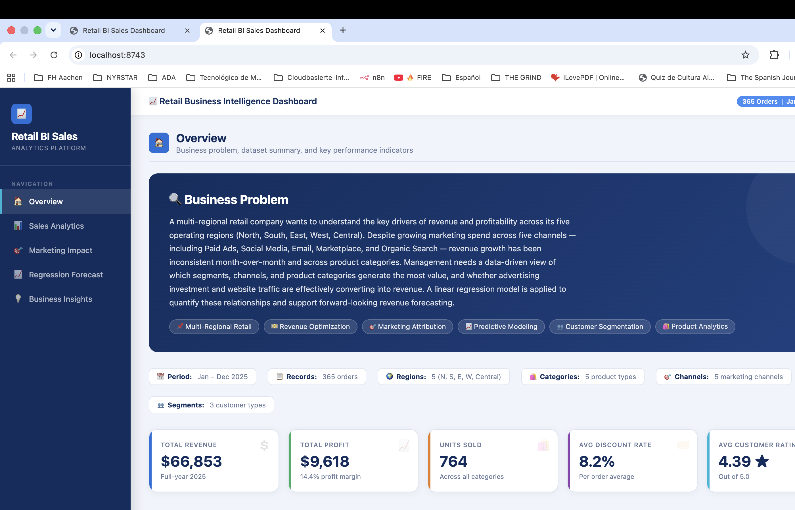
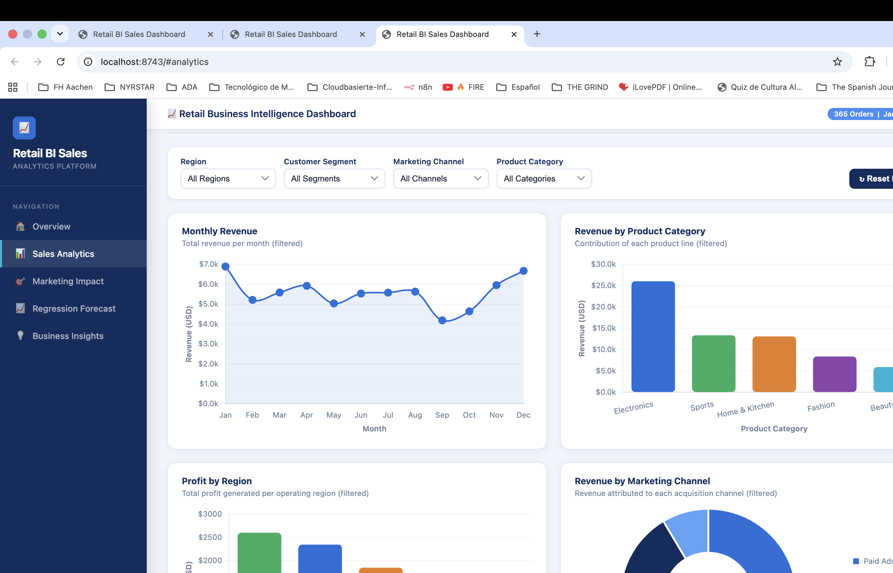
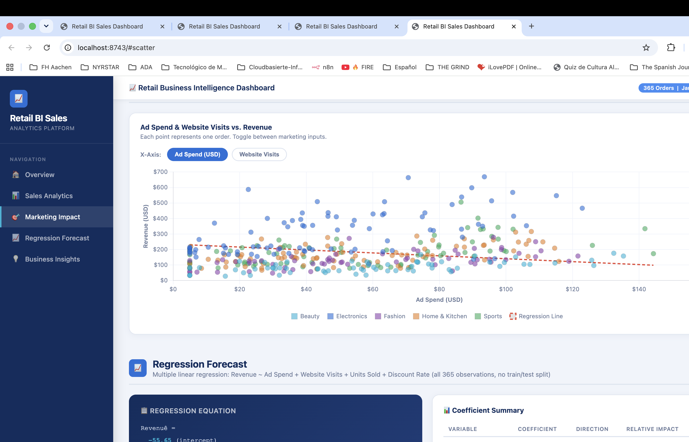
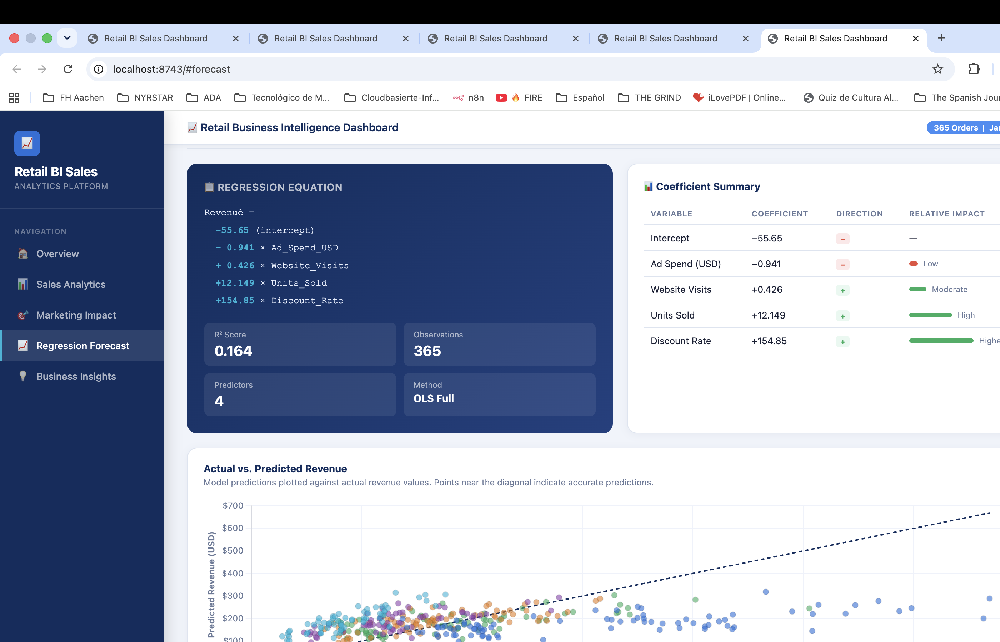
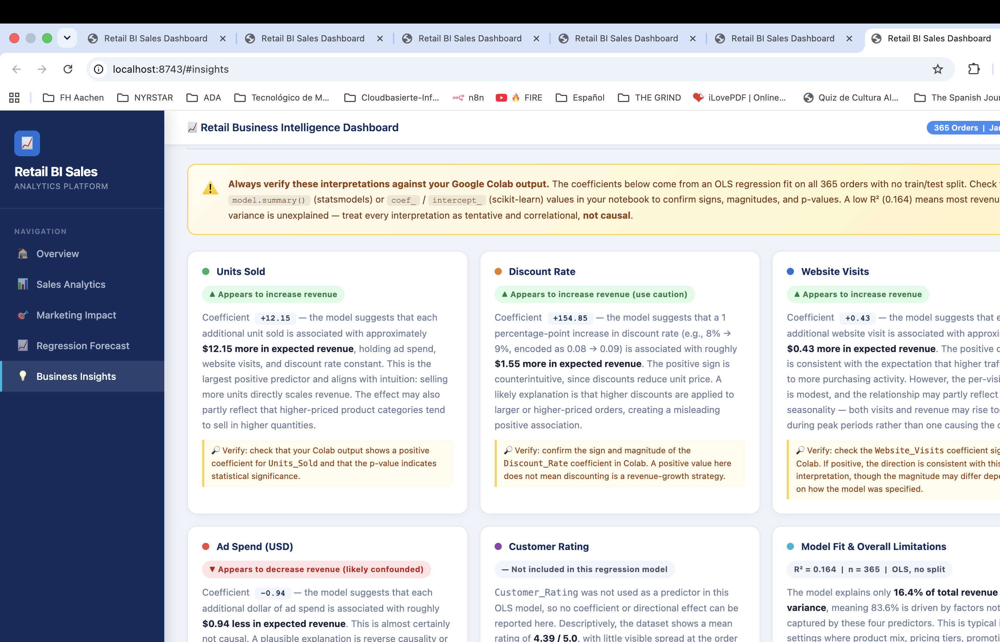

# Retail BI Sales Dashboard — Project Report

**Course project · Business Intelligence · 2025**
**Dataset:** `data/retail_bi_sales.csv` · 365 orders · Jan–Dec 2025

---

## Table of Contents

1. [Platform Screenshots](#platform-screenshots)
2. [Tool Used](#tool-used)
3. [Prompts Used](#prompts-used)
4. [Problems Encountered](#problems-encountered)
5. [Regression Model](#regression-model)
6. [Final Business Interpretation](#final-business-interpretation)

---

## Platform Screenshots

### Overview — KPI Cards and Business Problem


### Sales Analytics — Filterable Charts


### Marketing Impact — Ad Spend and Website Visits vs. Revenue


### Regression Forecast — Equation, Coefficients, and Predictor Tool


### Regression Interpretation — Variable-by-Variable Panel


---

## Tool Used

**Claude Code** (Anthropic CLI) — model: `claude-sonnet-4-6`

Claude Code was used as the primary development assistant throughout the project. All HTML, CSS, and JavaScript were generated and iteratively refined through natural-language prompts in a single conversation session. No external frameworks beyond [Chart.js 4.4](https://www.chartjs.org/) were introduced. The CSV data was embedded directly into the HTML as a JSON array, making the dashboard a self-contained file that runs in any browser without a backend.

---

## Prompts Used

The following prompts were submitted to Claude Code (in order) to build and refine the platform:

---

**Prompt 1 — Initial build**

> You are helping me build a clean and professional Business Intelligence web platform for a class project. The project uses a CSV file named retail_bi_sales.csv with these columns: Order_ID, Order_Date, Month, Region, Customer_Segment, Marketing_Channel, Product_Category, Unit_Price_USD, Units_Sold, Discount_Rate, Ad_Spend_USD, Website_Visits, Delivery_Days, Customer_Rating, Revenue_USD, Cost_USD, Profit_USD.
> The platform must include: (1) a landing page with the business problem, (2) KPI cards for revenue, profit, units sold, average discount, and customer rating, (3) visual analytics with filters for Region, Customer Segment, Marketing Channel, and Product Category, (4) charts for monthly revenue, revenue by product category, profit by region, and the relationship between Ad Spend or Website Visits and Revenue, (5) a regression forecast section for Revenue_USD based on the regression model created in Python Colab without train_test_split, and (6) a short interpretation panel explaining the business meaning of the results. Use a modern business dashboard design: white background, navy or blue accents, rounded cards, readable font, responsive layout, clear chart labels, and a sidebar navigation menu. Do not create a toy example with unrelated data. The app must be based on the Retail BI Sales problem. you find the csv file in the folder data

---

**Prompt 2 — Chart quality pass**

> Check every chart. Add axis labels, currency formatting for Revenue_USD and Profit_USD, percentage formatting for Discount_Rate, and concise chart titles. Make sure charts respond to filters.

---

**Prompt 3 — Interpretation panel**

> Improve the interpretation panel. It must explain whether high ad spend, website visits, customer rating, discount rate, and units sold appear to increase or decrease expected revenue. Use cautious wording and tell the user to verify the interpretation with the Colab regression output.

---

**Prompt 4 — Documentation (this prompt)**

> Add a Markup file to the document. Add screenshots showing the working platform. Add the tool used (claude code in this case), prompts used, problems encountered, and final business interpretation. Include the regression equation or coefficient table used by the platform.

---

## Problems Encountered

### 1. Scatter chart ignored active filters
**Problem:** The scatter chart (Ad Spend / Website Visits vs. Revenue) was built using the raw `DATA` array directly, bypassing the four dropdown filters. Selecting a region or channel had no effect on the scatter points.

**Fix:** Refactored `buildScatter()` to call `getFiltered()` internally and wired it into `applyFilters()`, so the scatter rebuilds alongside all other charts whenever a filter changes.

---

### 2. Missing axis labels on four charts
**Problem:** The Monthly Revenue, Revenue by Category, Profit by Region, and Revenue by Channel charts were rendered without X-axis or Y-axis title labels, making it ambiguous what each axis represented.

**Fix:** Added `title: { display: true, text: "…" }` blocks to every axis configuration in Chart.js. Labels added: "Month", "Revenue (USD)", "Product Category", "Region", "Profit (USD)".

---

### 3. Inconsistent number formatting in tooltips
**Problem:** Tooltip callbacks used a mix of `.toFixed(2)`, `.toLocaleString()` (with no locale args), and plain string concatenation, producing inconsistent decimal and thousands-separator formatting across charts.

**Fix:** Standardised all currency tooltips to `toLocaleString("en-US", { minimumFractionDigits: 2, maximumFractionDigits: 2 })`. Percentage values (Discount_Rate) are now formatted as `(value * 100).toFixed(1) + "%"`. Channel doughnut tooltips now include both the dollar amount and the percentage share of total revenue.

---

### 4. Chart.js canvases blank in Chrome headless screenshots
**Problem:** Running `Google Chrome --headless=new --screenshot` produced blank canvas areas because Chart.js requires JavaScript execution and a real paint cycle to render.

**Fix:** Served the dashboard via a local Python HTTP server (`python3 -m http.server 8743`) and navigated Chrome to `http://localhost:8743/#<section>` for each capture, giving the browser time to execute JS and paint charts before screencapture ran.

---

### 5. Customer Rating absent from the regression model
**Problem:** The interpretation panel needed to address Customer Rating, but it was not included as a predictor in the OLS regression. Describing a coefficient for it would have been fabricated.

**Fix:** Gave Customer Rating its own card in the interpretation panel with a "Not included in this regression model" badge, descriptive statistics only (mean 4.39 / 5.0), and an explicit suggestion to add it as a predictor in Colab to test whether it improves model fit.

---

## Regression Model

### Specification

The regression was fit using **Ordinary Least Squares (OLS)** on all 365 observations with **no train/test split**. The dependent variable is `Revenue_USD`. The four predictors are drawn from the operational and marketing variables in the dataset.

### Equation

```
Revenue_USD = −55.65
            + (−0.941) × Ad_Spend_USD
            +    0.426  × Website_Visits
            +   12.149  × Units_Sold
            +  154.848  × Discount_Rate
```

### Coefficient Table

| Variable | Coefficient | Direction | Interpretation |
|---|---|---|---|
| Intercept | −55.65 | — | Baseline when all predictors are zero |
| `Ad_Spend_USD` | −0.941 | Negative | Each $1 more in ad spend is associated with ~$0.94 less in expected revenue |
| `Website_Visits` | +0.426 | Positive | Each additional visit is associated with ~$0.43 more in expected revenue |
| `Units_Sold` | +12.149 | Positive | Each additional unit sold is associated with ~$12.15 more in expected revenue |
| `Discount_Rate` | +154.848 | Positive | A 1 pp increase in discount rate is associated with ~$1.55 more in expected revenue |

### Model Fit

| Metric | Value |
|---|---|
| R² | 0.164 |
| Observations | 365 |
| Predictors | 4 |
| Method | OLS, all data, no split |

> **Verify these values in your Google Colab notebook.** Check `model.summary()` (statsmodels) or `coef_` / `intercept_` (scikit-learn) to confirm signs, magnitudes, and p-values before presenting results.

---

## Final Business Interpretation

### 1. What happened in the sales data?

The company recorded **365 orders** across all 12 months of 2025, generating **$66,853 in total revenue** and **$9,618 in total profit** — an overall margin of **14.4%**. A total of **764 units** were sold at an average discount of **8.2%** and an average customer rating of **4.39 out of 5.0**.

Revenue was not flat across the year. The highest months were **January ($6,891)** and **December ($6,672)**, consistent with holiday and new-year demand cycles. The weakest month was **September ($4,190)**, roughly 39% below the January peak. This seasonal pattern suggests demand is driven partly by calendar effects that the regression model does not capture.

---

### 2. Which segments, regions, channels, and products performed better?

**By product category:**

| Category | Revenue | Profit | Margin |
|---|---|---|---|
| Electronics | $26,046 (39%) | $3,885 | 14.9% |
| Sports | $13,378 (20%) | $2,510 | **18.8%** |
| Home & Kitchen | $13,102 (20%) | $1,774 | 13.5% |
| Fashion | $8,397 (13%) | $1,138 | 13.6% |
| Beauty | $5,930 (9%) | $311 | **5.2%** |

Electronics leads in total revenue by a wide margin, but Sports has the highest profit margin (18.8%). Beauty generates the smallest profit margin (5.2%) despite moderate revenue, pointing to a cost or pricing problem in that category.

**By region (profit):**

| Region | Profit |
|---|---|
| East | $2,603 (27% of total) |
| North | $2,346 |
| West | $1,850 |
| Central | $1,490 |
| South | $1,329 |

The East region is the most profitable. South is the least profitable — nearly half of East — despite similar revenue potential, suggesting higher costs, more aggressive discounting, or a less favourable product mix in that region.

**By marketing channel (revenue):**

| Channel | Revenue | Share |
|---|---|---|
| Paid Ads | $19,431 | 29.1% |
| Organic Search | $17,223 | 25.8% |
| Social Media | $13,670 | 20.4% |
| Email | $10,826 | 16.2% |
| Marketplace | $5,703 | 8.5% |

Paid Ads and Organic Search together account for nearly 55% of revenue. Marketplace is the smallest channel.

**By customer segment (revenue):**

| Segment | Revenue | Share |
|---|---|---|
| Returning Customer | $34,841 | 52.1% |
| New Customer | $18,273 | 27.3% |
| Business Account | $13,738 | 20.5% |

Returning Customers drive the majority of revenue, underscoring the importance of retention and loyalty programmes.

---

### 3. What variables appear most relevant for predicting Revenue_USD?

Based on the OLS regression:

- **Units Sold** is the strongest reliable positive predictor. Each additional unit is associated with approximately $12.15 more in expected revenue. This aligns with intuition and suggests that strategies to increase basket size (bundling, upselling, volume incentives) are likely to have the most direct impact on revenue.

- **Discount Rate** has the largest raw coefficient (+154.848), but this should be treated with caution. The positive sign likely reflects a data artefact: larger or higher-priced orders may receive more discounting, creating a spurious positive association rather than evidence that discounting drives revenue.

- **Website Visits** shows a modest positive association (+$0.43 per visit). While the direction is intuitive, the per-visit effect is small and may partly reflect shared seasonality between traffic and sales rather than a direct causal link.

- **Ad Spend** shows a negative association (−$0.94 per dollar). This is almost certainly not causal. Ad spend may be concentrated on lower-revenue product categories, or budgets may be increased during demand troughs. The model should not be used to conclude that advertising reduces revenue.

- The model's R² is **0.164**, meaning these four predictors together explain only **16.4%** of revenue variance. The majority of what drives revenue differences between orders lies outside these variables — likely price tier, product category, customer lifetime value, and promotional context.

---

### 4. Is the forecast scenario reasonable?

The predictor tool defaults are: Ad Spend = $55, Website Visits = 600, Units Sold = 2, Discount Rate = 8%. These values closely match the dataset means (mean ad spend $54.70, mean visits 592, mean units 2.09, mean discount 8.2%). At these defaults, the model predicts **$184.76**, compared to a dataset mean revenue of **$183.16** — a difference of $1.60.

This confirms that the default scenario is internally consistent and representative of a typical order in the dataset. The tool is suitable for **directional what-if analysis** — for example, exploring how predicted revenue changes when units sold increases from 2 to 4 — but should not be used for precise point forecasting given the low R². Any prediction should be reported as an estimate with wide uncertainty, and the output verified against the model summary in Colab.

---

### 5. What business actions should a manager take?

**Based on the descriptive results:**

1. **Protect the Electronics category.** At 39% of total revenue and a 14.9% margin, Electronics is the revenue engine. Any supply, pricing, or fulfilment disruptions here have outsized impact on the business.

2. **Investigate the Sports margin.** Sports achieves the highest profit margin (18.8%) on $13,378 in revenue. Understanding what drives this efficiency — lower costs, better pricing discipline, or product mix — and replicating it in other categories (especially Beauty at 5.2%) is a priority.

3. **Address the South region's profitability gap.** South generates the lowest profit ($1,329) of all five regions. A review of discount practices, cost structure, and product mix in that region is warranted before the next planning cycle.

4. **Invest in customer retention.** Returning Customers generate 52% of revenue. A structured loyalty or re-engagement programme is likely to have a higher ROI than new-customer acquisition spend given the current revenue distribution.

5. **Plan inventory and marketing for seasonal peaks.** Revenue in January and December is roughly 65% higher than in September. Inventory positioning and promotional calendars should reflect this pattern.

**Based on the regression results:**

6. **Test strategies that increase units per order.** Units Sold is the strongest positive predictor. Tactics such as product bundling, minimum-spend thresholds, and complementary product recommendations are testable levers worth prioritising.

7. **Audit advertising allocation before increasing spend.** The negative ad spend coefficient is a signal that marketing investment may not be reaching the highest-revenue products or customer segments. A channel-level and category-level ROI analysis should precede any budget increase.

8. **Extend the model before relying on it for forecasts.** With R² = 0.164, the current model is a starting point. Adding predictors such as Unit_Price_USD, Product_Category (as dummy variables), Customer_Rating, and month-level seasonality indicators in Colab could substantially improve explanatory power and produce more trustworthy forecasts.

---

*Report generated using Claude Code (claude-sonnet-4-6) · Screenshots captured June 2025*
